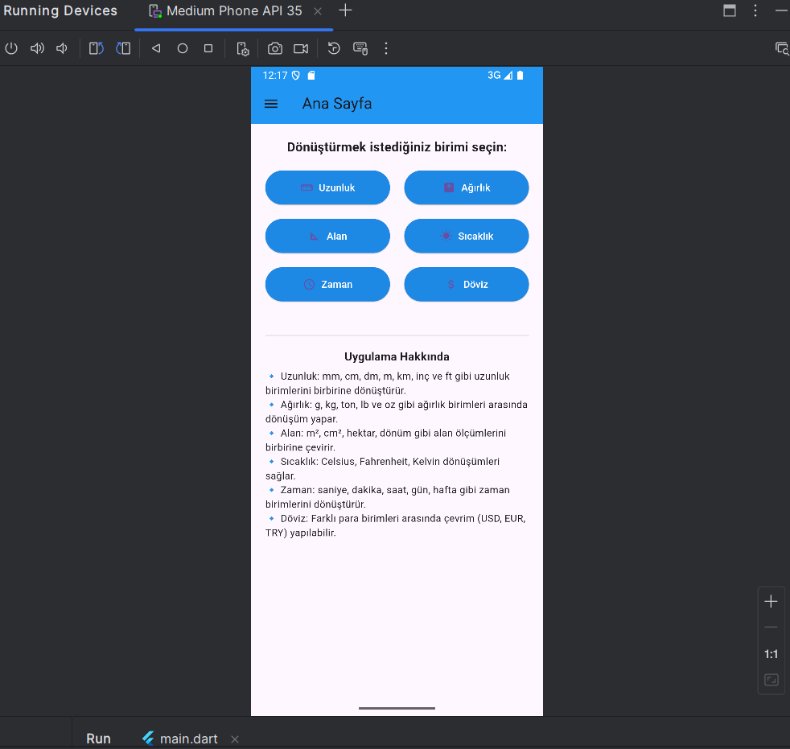
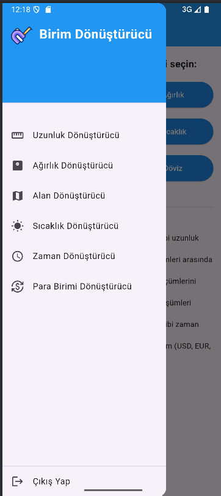
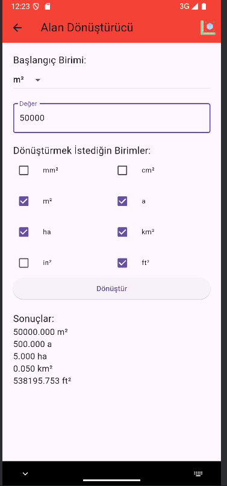
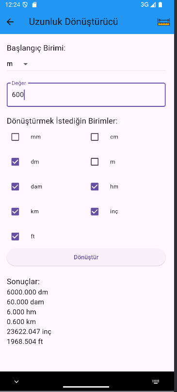
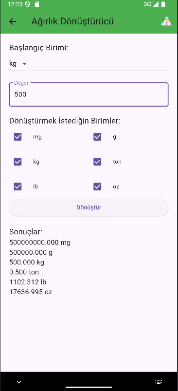
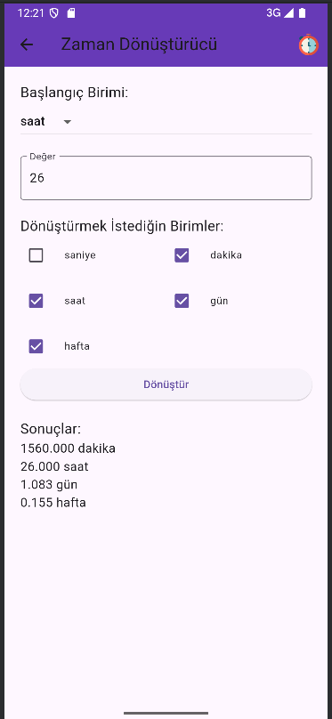
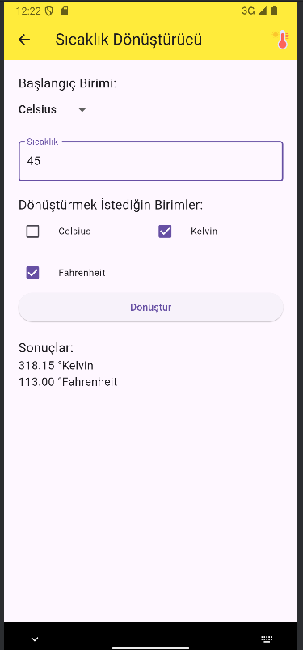
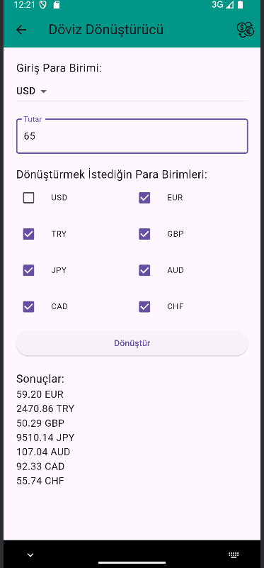

# 📱 Birim Dönüştürücü

Birim Dönüştürücü, kullanıcıların **uzunluk, ağırlık, alan, sıcaklık, zaman ve hacim** gibi farklı ölçü birimlerini hızlı ve kolay biçimde dönüştürmesine olanak tanıyan bir **Flutter** uygulamasıdır. Modern arayüzü, çevrim-dışı/çevrim-içi çalışabilen mantığı ve bulutta tutulan kullanıcı verileriyle pratik bir deneyim sunar.

---

## Projenin Amacı
Günlük hayatta sıkça ihtiyaç duyulan ölçü birimi dönüşümlerini tek bir mobil uygulamada toplamak; kullanıcıların farklı uygulamalar arasında geçiş yapmadan güvenilir ve kolay erişilebilir bir araç kullanmasını sağlamaktır.

---

## Teknik Detaylar
- **Flutter (Dart)** : Uygulamanın temel geliştirme platformu  
- **Firebase Authentication** : Güvenli kullanıcı kimlik doğrulama  
- **Cloud Firestore** : Notlar ve ayarlar vb. için gerçek-zamanlı veritabanı  
- **Supabase**   : Yedek veri depolama + REST API desteği  
- **HTTP/JSON**   : Harici hizmetlerden (Flaticon logosu vb.) veri çekmek için  
- **Responsive Tasarım** : Tüm cihaz boyutlarına uyumlu esnek arayüz  

---

## Öne Çıkan Özellikler
- **Kullanıcı Girişi** : Firebase Auth ile güvenli oturum yönetimi  
- **Çoklu Dönüştürücü** : Uzunluk, ağırlık, alan, sıcaklık, zaman, **hacim** kategorileri  
- **Bulut Senkronizasyonu** : Firestore + Supabase ile verilerin cihazlar arasında eşitlenmesi  
- **Offline Desteği**  : Çevrim-dışı hesaplama    
- **Çekici UI**   : Drawer navigasyonu, özelleştirilebilir renk şeması  

---

## Kullanılan Teknolojiler
- **Flutter SDK / Dart 3**  
- **Firebase (Auth & Firestore)**  
- **Supabase**  
- **HTTP / JSON Decode**  
- **Flaticon** (logo görselleri)  
- **Visual Studio Code**  
- **Android Studio / Emulator**
- ---

## Sayfaların Görevleri ve İçerikleri

1. **Giriş Yap Ekranı (`login.dart`)**
   - Kullanıcı, e-posta ve şifre ile kimlik doğrulaması yapar (Firebase Auth).
   - Hatalı giriş uyarıları, şifreyi gizle/göster seçeneği bulunur.
   - Başarılı oturum açma sonrası **Ana Sayfa**ya yönlendirilir.

2. **Kayıt Ol Ekranı (`signup.dart`)**
   - Yeni kullanıcı oluşturur; e-posta doğrulama ve minimum şifre kriterleri kontrolü.
   - Firebase Auth’a kayıt yapıldıktan sonra giriş ekranına veya direkt Ana Sayfa’ya yönlendirir.

3. **Ana Sayfa (`home_page.dart`)**
   - Dönüştürücü kategorilerini (Hacim, Uzunluk, Alan, Ağırlık, Sıcaklık, Zaman) grid kartlar hâlinde listeler.
   - Drawer menüsüne ve profil / ayarlar kısayollarına hızlı erişim sağlar.

4. **Hacim Dönüştürücü (`volume_converter.dart`)**
   - Ör. Litre → Mililitre, Galon → Litre gibi dönüşümleri destekler.
   - İki-yönlü (source/target) anlık güncelleme, kopyala/temizle butonları.

5. **Uzunluk Dönüştürücü (`length_converter.dart`)**
   - Ör. Kilometre → Santimetre, Metre → Feet.
   - Ondalık destekli, gerçek-zamanlı sonuç gösterimi.

6. **Ağırlık Dönüştürücü (`weight_converter.dart`)**
   - Ör. Kilogram → Gram, Libre → Kilogram.
   - İç içe dropdown seçimleriyle birim takası.

7. **Alan Dönüştürücü (`area_converter.dart`)**
   - Ör. Metrekare → Santimetrekare, Acre → Hektar.
   - Geniş/liste görünümüyle hesaplanan sonuç paneli.

8. **Sıcaklık Dönüştürücü (`weather_converter.dart`)**
   - Ör. ° C ↔ ° F ↔ K.
   - Negatif, ondalık değer kabulü; input alanlarında otomatik seç-sil.

9. **Zaman Dönüştürücü (`time_converter.dart`)**
   - Ör. Dakika → Saat, Gün → Saniye.
   - Süre çarpanları tablo görünümünde anlık güncellenir.

10. **Profil Ekranı (`profile_page.dart`)**
    - Kullanıcının kayıtlı adı, e-postası ve profil görseli (isteğe bağlı Supabase Storage) gösterilir.
    - “Çıkış Yap”, “Şifre Değiştir” gibi işlemler.

11. **Ayarlar Ekranı (`settings_page.dart`)**
    - Tema (karanlık/açık/sistem) seçimi.
    - Hesap & bildirim tercihleri; uygulama sürüm bilgisi.

> **Not (Yeniden Kullanılan Bileşenler):**  
> - `drawer_menu.dart` & `app_drawer.dart` → Uygulama genelinde yan menü gezintisi  
> - `custom_app_bar.dart` → Her ekrana özel başlık çubuğu  
> - `base_page.dart` → Ortak Scaffold + AppBar + Drawer iskeleti
---

---

## 🧭 Drawer Menü ve Logo API Bilgileri

Drawer menüsündeki başlık, logoyu uzaktan (Flaticon) alır ve kullanıcıya kategorilere hızlı erişim sunar.

| Alan | Değer |
| ---- | ----- |
| **Dosya** | `lib/widgets/app_drawer.dart` |
| **Logo URL’i** | `https://cdn-icons-png.flaticon.com/512/18995/18995004.png` |
| **Teknik** | `Image.network` (isteğe bağlı `CachedNetworkImage`) ile önbellek desteği |

---

## 👥 Grup Üyelerinin Projeye Katkısı

* **Abdullatif AKKAYA**
  - Ana sayfa (`home_page.dart`) ve kategori ızgara tasarımı  
  - Hacim dönüştürücü (`volume_converter.dart`)  
  - Uzunluk dönüştürücü (`length_converter.dart`)  
  - Drawer alt menülerinin rota yönlendirmeleri  
  - README / proje dokümantasyonu  

* **Abdussamet OĞUZ**
  - Kimlik doğrulama ekranları (`login.dart`, `signup.dart`)  
  - Drawer bileşenleri (`app_drawer.dart`) & özel AppBar (`custom_app_bar.dart`)  
  - Profil (`profile_page.dart`) ve Ayarlar (`settings_page.dart`) ekranları  
  - Supabase servis katmanı & REST API entegrasyonu  
  - Logo API entegrasyonu ve genel UI ince ayarları  

* **Yusuf Talha ERDOĞMUŞ**
  - Ağırlık (`weight_converter.dart`), Alan (`area_converter.dart`), Zaman (`time_converter.dart`) ve Sıcaklık (`weather_converter.dart`) dönüştürücüleri  
  - **Firebase Authentication** ve **Cloud Firestore** yapılandırması (kullanıcı + veri senkronizasyonu)  
  - Tema yönetimi & responsive tasarım (`theme.dart`)  
  - Ortak veritabanı yardımcıları (`database_helper.dart`)  

---

## 💬 Diğer Bilgiler

- Proje [Flutter / Sqlite] kullanılarak geliştirilmiştir.

---
## 📸 Uygulama İçi Görseller

### 🏠 Ana Sayfa

### 📦 Drawer Menü

### 🌍 Alan Dönüştürücü

### 📏 Uzunluk Dönüştürücü

### ⚖️ Ağırlık Dönüştürücü

### ⏱️ Zaman Dönüştürücü

### 🌡️ Sıcaklık Dönüştürücü

### 💱 Döviz Dönüştürücü

---

